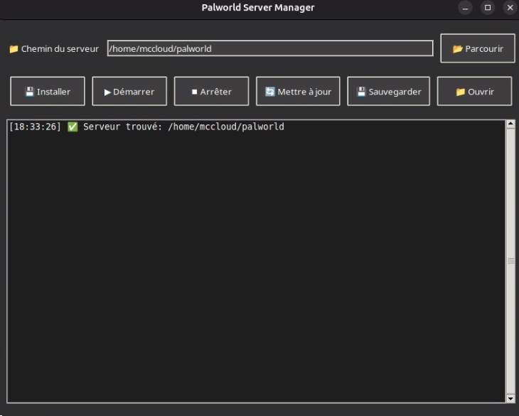

# Palworld-Server-Manager

Un gestionnaire de serveur graphique pour Palworld sous Linux.



## À propos

Ce projet a été développé par BlaMacfly sur Ubuntu 24.04.2 LTS. Il est conçu pour fonctionner sur les systèmes Linux et faciliter la gestion des serveurs Palworld.

## Fonctionnalités

- Interface graphique conviviale
- Démarrage/Arrêt du serveur
- Sauvegarde automatique
- Mise à jour du serveur
- Installation facile

## Prérequis

- Linux (testé sur Ubuntu 24.04.2 LTS)
- Python 3.x
- pip (gestionnaire de paquets Python)
- Steam (pour l'installation du serveur)

## Installation

1. Clonez ce dépôt :
```bash
git clone https://github.com/BlaMacfly/palworld-server-manager.git
cd palworld-server-manager
```

2. Installez les dépendances :
```bash
pip install -r requirements.txt
```

3. Lancez le gestionnaire :
```bash
python3 palworld_manager.py
```

## Utilisation

1. Lancez l'application depuis le menu des applications ou via la ligne de commande
2. Sélectionnez le dossier d'installation du serveur Palworld
3. Utilisez les boutons pour gérer votre serveur :
   - Installer : Installe ou réinstalle le serveur
   - Démarrer : Lance le serveur
   - Arrêter : Arrête le serveur proprement
   - Mettre à jour : Met à jour le serveur via Steam
   - Sauvegarder : Crée une sauvegarde du serveur
   - Ouvrir : Ouvre le dossier du serveur

## Contribution

Les contributions sont les bienvenues ! N'hésitez pas à ouvrir une issue ou une pull request.

## Licence

Ce projet est sous licence MIT - voir le fichier [LICENSE](LICENSE) pour plus de détails.

## Auteur

- **BlaMacfly** - [GitHub](https://github.com/BlaMacfly)
